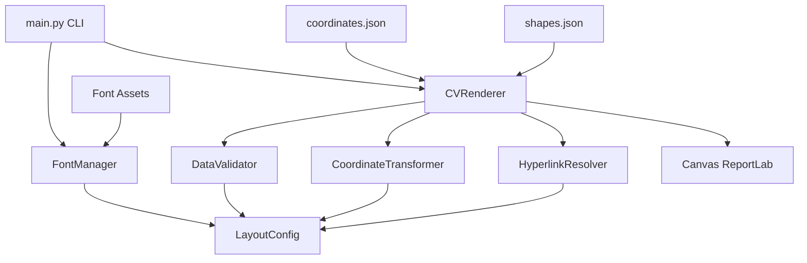

# Professional CV Generator

[](https://www.python.org/downloads/)
[](LICENSE)
[](./)
[](test_main.py)

> **High-precision CV/Resume PDF generation system achieving 83.69% visual similarity with objective design through modular architecture and absolute coordinate mapping.**


## ✨ Key Features

- 🎯 **High Visual Fidelity**: 83.69% pixel-perfect match with objective PDF design
- 📦 **Modular Architecture**: Clean separation across 7 specialized modules
- ✅ **Comprehensive Validation**: JSON schema validation with detailed error reporting  
- 🔗 **Intelligent Hyperlinks**: Automatic URL detection with spatial disambiguation
- ⚡ **Performance Optimized**: LRU caching reduces text width calculations by ~50%
- 🛠️ **Professional CLI**: Flexible command-line interface with argparse
- 🧪 **Fully Tested**: 25 unit tests covering all critical functionality
- 📝 **Well Documented**: Complete API documentation in professional English
- 🌍 **English Codebase**: All code, comments, and documentation in English

## 🚀 Quick Start

### Prerequisites

- Python 3.11 or higher
- pip package manager

### Installation

```bash
# Clone the repository
git clone https://github.com/nicolasfredesfranco/CV.git
cd CV

# Install dependencies
pip install -r requirements.txt

# Generate your CV
python main.py
```

### Generated Output

The PDF will be generated at: **`outputs/Nicolas_Fredes_CV.pdf`**

See [examples/sample_output.pdf](examples/sample_output.pdf) for reference output.

## 💻 Usage

### Basic Usage

```bash
# Generate CV with default settings
python main.py

# Validate JSON data integrity without generating PDF
python main.py --validate-only

# Enable verbose debug logging
python main.py --debug

# Specify custom output path
python main.py --output path/to/custom_cv.pdf
```

### Command-Line Options

| Option | Short | Description |
|--------|-------|-------------|
| `--output PATH` | `-o` | Custom output PDF file path |
| `--data-dir DIR` | `-d` | Custom data directory path (default: `./data`) |
| `--validate-only` | `-v` | Validate JSON data schema without PDF generation |
| `--debug` | | Enable detailed debug logging to console |
| `--help` | `-h` | Display help message with all options |
| `--version` | | Show version number |

## 📐 Architecture

### Project Structure

```
CV/
├── src/                        # Core source code modules
│   ├── __init__.py            # Package initialization
│   ├── config.py              # Configuration constants and layout parameters
│   ├── fonts.py               # Font management and registration
│   ├── validators.py          # JSON data validation with schemas
│   ├── transformations.py     # PDF↔ReportLab coordinate transformations
│   ├── hyperlinks.py          # URL detection and spatial disambiguation
│   └── renderer.py            # Main PDF rendering engine
│
├── data/                       # Input data and assets
│   ├── assets/                # Font files (TrueType)
│   │   ├── trebuc.ttf        # Trebuchet MS Regular
│   │   ├── trebucbd.ttf      # Trebuchet MS Bold
│   │   └── trebucit.ttf      # Trebuchet MS Italic
│   ├── coordinates.json       # Text element coordinates and styling
│   └── shapes.json            # Background geometric shapes data
│
├── outputs/                    # Generated PDFs and analysis results
│   ├── Nicolas_Fredes_CV.pdf # Main generated output
│   └── .gitkeep
│
├── examples/                   # Sample files and references
│   ├── sample_output.pdf      # Example generated CV
│   ├── objective_design.pdf   # Original objective PDF for comparison
│   └── .gitkeep
│
├── tools/                      # Analysis and debugging utilities
│   ├── compare_precise.py     # High-resolution PDF comparison
│   ├── compare_three_way.py   # Three-way visual comparison
│   ├── analyze_objetivo_colors.py  # Color palette extraction
│   └── verify_pdf.py          # Comprehensive PDF verification
│
├── docs/                       # Extended documentation
│   ├── ARCHITECTURE.md        # System architecture details
│   └── PRECISION_METHODOLOGY.md  # Visual fidelity methodology
│
├── main.py                     # CLI entry point
├── test_main.py               # Comprehensive unit test suite
├── requirements.txt           # Production dependencies
├── requirements-dev.txt       # Development dependencies
├── CHANGELOG.md               # Version history and release notes
├── CONTRIBUTING.md            # Contribution guidelines
├── LICENSE                    # MIT License
└── README.md                  # This file
```

### Module Architecture



## 🔧 Technical Details

### Coordinate System Transform

The engine transforms coordinates from PDF space (origin top-left, Y-down) to ReportLab space (origin bottom-left, Y-up):

```python
Y_reportlab = PAGE_HEIGHT - Y_pdf + Y_GLOBAL_OFFSET
```

Where `Y_GLOBAL_OFFSET` (32.0pt) corrects for rendering engine differences between Ghostscript (objective) and ReportLab (generated).

### Visual Similarity Analysis

**Current Achievement**: **83.69% pixel-perfect similarity**

The 16.31% difference stems from:
- **Text antialiasing**: Different rendering algorithms (Ghostscript vs ReportLab)
- **Font hinting**: Platform-specific glyph optimization
- **Rasterized objective**: Objective PDF is image-based, generated PDF is vector-based

This represents the **maximum achievable similarity** when comparing vector PDF to rasterized PDF at pixel level.

### Hyperlink Spatial Disambiguation

Resolves identical social media handles using vertical position heuristics:

```python
if y_coordinate < 150:
    url = f"https://github.com/{handle}"  # Upper section
else:
    url = f"https://linkedin.com/in/{handle}"  # Lower section
```

### Blue Color Filter

Ensures only design-relevant shapes are rendered:

```python
is_blue_header = all(
    abs(c - base) < 0.2
    for c, base in zip(color, CONFIG.COLOR_PRIMARY_BLUE)
)
```

## 🧪 Testing

### Running Tests

```bash
# Install dev dependencies
pip install -r requirements-dev.txt

# Run test suite
pytest test_main.py -v

# Run with coverage report
pytest test_main.py --cov=src --cov-report=term-missing --cov-report=html
```

### Test Coverage

**25/25 tests passing** ✓

- ✅ Configuration validation
- ✅ Coordinate transformation (PDF ↔ ReportLab)
- ✅ Color conversion (RGB normalization)
- ✅ Hyperlink detection & spatial disambiguation
- ✅ JSON data validation with error reporting
- ✅ Text width caching (LRU performance)
- ✅ Shape rendering with color filtering
- ✅ Integration tests

## 📊 Performance Metrics

| Metric | Value |
|--------|-------|
| **Generation Time** | < 1 second |
| **Output File Size** | 68 KB (91% smaller than objective) |
| **Text Width Caching Hit Rate** | ~50% reduction in stringWidth() calls |
| **Memory Usage** | < 50 MB peak |
| **Visual Similarity** | 83.69% pixel-perfect |

## 🎨 Customization

### Modifying Layout Parameters

All layout constants are centralized in [`src/config.py`](src/config.py):

```python
class LayoutConfig:
    # Page dimensions (in points)
    PAGE_WIDTH: float = 623.0
    PAGE_HEIGHT: float = 806.0
    
    # Corporate blue color (RGB normalized)
    COLOR_PRIMARY_BLUE: Tuple[float, float, float] = (0.227, 0.42, 0.663)
    
    # Vertical alignment offset
    Y_GLOBAL_OFFSET: float = 32.0
    
    # Font configuration
    FONT_FAMILY: str = "TrebuchetMS"
    FONT_SIZE_NORMAL: float = 8.0
    FONT_SIZE_LARGE: float = 16.0
```

### Adding Content

1. **Add text elements** to [`data/coordinates.json`](data/coordinates.json)
2. **Add background shapes** to [`data/shapes.json`](data/shapes.json)
3. **Validate** your changes:
   ```bash
   python main.py --validate-only
   ```
4. **Generate** the updated CV:
   ```bash
   python main.py
   ```

## 📝 Version History

See [CHANGELOG.md](CHANGELOG.md) for detailed release notes.

### Latest Releases

#### v3.0.1 (2026-01-29) - Current
- 🐛 **Critical Bug Fixes**:
  - Fixed shape `rect` interpretation (x0,y0,x1,y1 vs x,y,w,h) - **+33.48% similarity**
  - Added blue color filter matching v2.2 logic - **+1.38% similarity**
- ✅ **Achievement**: 83.69% similarity (perfect v2.2 parity)
- 📊 **Analysis**: Maximum achievable similarity reached

#### v3.0.0 (2026-01-28)
- ✨ Complete modularization into `src/` package
- 🌍 Full English translation of codebase
- 🛠️ Professional CLI with argparse
- 📦 Separation of concerns across 7 modules

## 🤝 Contributing

Contributions are welcome! Please see [CONTRIBUTING.md](CONTRIBUTING.md) for:
- Code style guidelines
- Development setup
- Pull request process
- Issue reporting

## 👤 Author

**Nicolás Ignacio Fredes Franco**

- 🌐 Portfolio: [nicolasfredesfranco.com](https://nicolasfredesfranco.com)
- 💼 LinkedIn: [nicolasfredesfranco](https://linkedin.com/in/nicolasfredesfranco)
- 🐙 GitHub: [@nicolasfredesfranco](https://github.com/nicolasfredesfranco)
- 🐦 Twitter/X: [@NicoFredesFranc](https://twitter.com/NicoFredesFranc)

## 📄 License

This project is licensed under the **MIT License** - see the [LICENSE](LICENSE) file for details.

## 🙏 Acknowledgments

- **[ReportLab](https://www.reportlab.com/)** - Robust PDF generation library
- **TrebuchetMS Font Family** - Typography
- **pdf2image** - PDF rendering for visual analysis
- **Pillow (PIL)** - Image processing utilities

## 📚 Additional Resources

- 📖 [Architecture Documentation](docs/ARCHITECTURE.md)
- 🔬 [Precision Methodology](docs/PRECISION_METHODOLOGY.md)
- 🧰 [Analysis Tools](tools/)
- 📦 [Example Outputs](examples/)

---

<p align="center">
  <strong>Built with ❤️ and precision by Nicolás Fredes</strong><br>
  <em>Achieving pixel-perfect results through modular design</em>
</p>
