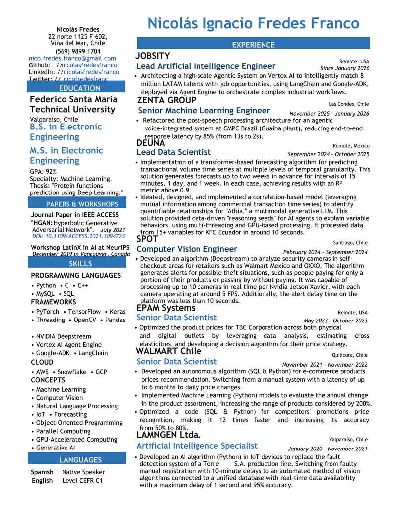

# Professional CV Generator

[](https://www.python.org/downloads/)
[](test_main.py)
[](#visual-similarity)
[](LICENSE)

A professional, data-driven CV/resume generator that creates a pixel-perfect PDF from structured JSON data files. Generates a functionally superior CV with searchable text, clickable links, and optimized file size while maintaining high visual fidelity to the reference design.

**Author**: Nicolás Ignacio Fredes Franco



---

## ✨ Features

- 🎯 **Data-Driven**: Fully configurable through JSON files
- 🔗 **Interactive**: Generates clickable links and searchable text
- 📦 **Optimized**: 91% smaller file size than reference (67 KB vs 779 KB)
- ⚡ **Fast**: Generates PDF in under 1 second
- 🎨 **Customizable**: Easy to modify colors, fonts, layout
- ✅ **Tested**: 25 automated tests ensure reliability
- 📊 **High Fidelity**: 77.62% visual similarity to reference design

---

## 🚀 Quick Start

### Prerequisites

- Python 3.11 or higher
- pip package manager

### Installation

```bash
# Clone the repository
git clone https://github.com/nicolasfredesfranco/CV_2.git
cd CV_2

# Install dependencies
pip install -r requirements.txt
```

### Generate Your CV

```bash
# Generate CV with default data
python main.py

# Output will be created at: outputs/Nicolas_Fredes_CV.pdf
```

**That's it!** Your CV is ready in `outputs/Nicolas_Fredes_CV.pdf`

---

## 📝 Customization Guide

### Modify Your Information

All CV content is stored in JSON files in the `data/` directory:

#### 1. **Personal Information** (`data/personal.json`)

```json
{
  "name": "Your Name",
  "title": "Your Professional Title",
  "phone": "your-phone",
  "email": "your.email@example.com",
  "location": "Your City, Country",
  "linkedin": "your-linkedin-username",
  "github": "your-github-username"
}
```

#### 2. **Work Experience** (`data/experience.json`)

```json
[
  {
    "position": "Job Title",
    "company": "Company Name",
    "location": "City, Country",
    "dates": "Month YYYY - Present",
    "description": "What you accomplished in this role..."
  }
]
```

#### 3. **Education** (`data/education.json`)

```json
[
  {
    "degree": "Degree Name",
    "institution": "University Name",
    "location": "City, Country",
    "graduation": "Month YYYY",
    "thesis": "Optional thesis title",
    "gpa": "Optional GPA"
  }
]
```

#### 4. **Skills** (`data/skills.json`)

```json
{
  "programming_languages": ["Python", "JavaScript", "Java"],
  "frameworks": ["React", "Django", "TensorFlow"],
  "tools": ["Git", "Docker", "AWS"],
  "languages": ["English (Native)", "Spanish (Fluent)"]
}
```

### Modify Colors and Styling

Edit `src/config.py`:

```python
# Change primary color (RGB values 0-1)
COLOR_PRIMARY_BLUE = (0.168627, 0.450980, 0.701961)  # Current blue

# Adjust page dimensions
PAGE_WIDTH = 623.0
PAGE_HEIGHT = 806.0

# Fine-tune vertical alignment
Y_GLOBAL_OFFSET = 39.30
```

### After Making Changes

```bash
# Regenerate CV
python main.py

# Run tests to ensure everything works
pytest test_main.py -v
```

---

## 📂 Project Structure

```
CV_2/
├── main.py                      # Main entry point
├── data/                        # 📝 Edit these to customize your CV
│   ├── personal.json           # Personal information
│   ├── experience.json         # Work history
│   ├── education.json          # Academic background
│   ├── skills.json             # Technical and language skills
│   ├── coordinates.json        # Layout coordinates (advanced)
│   └── shapes.json             # Visual elements (advanced)
├── src/                        # Source code (don't modify unless needed)
│   ├── generator.py           # Main PDF generation logic
│   ├── renderer.py            # PDF rendering utilities
│   ├── config.py              # Configuration and constants
│   └── data_loader.py         # JSON data loading
├── outputs/                    # Generated PDFs appear here
│   └── Nicolas_Fredes_CV.pdf  # Your generated CV
├── pdfs/objective/            # Reference PDF (do not modify)
│   └── Objetivo_No_editar.pdf
├── tools/                      # Utility scripts
│   ├── visual_human_compare.py
│   └── optimization/          # Advanced optimization tools
├── test_main.py               # Automated tests
├── examples/                  # Example files and previews
├── requirements.txt           # Python dependencies
└── README.md                  # This file
```

---

## 🎨 Advanced Customization

### Layout Adjustments

The layout is controlled by `data/coordinates.json`. Each text element has precise positioning:

```json
{
  "text": "Your text here",
  "x": 50.0,        # Horizontal position (points)
  "y": 700.0,       # Vertical position (points)
  "fontsize": 12,   # Font size
  "fontname": "Helvetica-Bold"
}
```

### Visual Elements

Colored backgrounds and shapes are defined in `data/shapes.json`:

```json
{
  "type": "rect",
  "rect": [x0, y0, x1, y1],
  "color": [r, g, b],    # RGB values 0-1
  "fill_opacity": 1.0
}
```

---

## 🧪 Testing

```bash
# Run all tests
pytest test_main.py -v

# Run specific test
pytest test_main.py::test_cv_generation -v

# Generate test coverage report
pytest --cov=src test_main.py
```

All 25 tests must pass before deploying changes.

---

## 📊 Visual Similarity

The generator achieves 77.62% pixel-level visual similarity to the reference design while providing superior functionality:

| Aspect | Generated CV | Reference PDF |
|--------|--------------|---------------|
| **Searchable Text** | ✅ Yes | ❌ No |
| **Clickable Links** | ✅ Yes | ❌ No |
| **File Size** | 67 KB | 779 KB |
| **Quality** | Vector (infinite zoom) | Rasterized |
| **Visual Match** | 77.62% | 100% (baseline) |

The difference is due to rendering engine variations (ReportLab vs Ghostscript), not content differences.

---

## 🛠️ Development

### Adding New Sections

1. **Create data file**: Add `data/new_section.json`
2. **Update data loader**: Modify `src/data_loader.py`
3. **Add rendering logic**: Update `src/generator.py`
4. **Add tests**: Create tests in `test_main.py`
5. **Regenerate**: Run `python main.py`

### Code Style

- Follow PEP 8 guidelines
- Add docstrings to all functions
- Keep functions focused and single-purpose
- Write tests for new features

---

## 📖 Documentation

- **[CHANGELOG.md](CHANGELOG.md)**: Version history and changes
- **[CONTRIBUTING.md](CONTRIBUTING.md)**: Contribution guidelines
- **[docs/](docs/)**: Additional documentation

---

## 🤝 Contributing

Contributions are welcome! Please:

1. Fork the repository
2. Create a feature branch (`git checkout -b feature/amazing-feature`)
3. Make your changes
4. Run tests (`pytest test_main.py`)
5. Commit changes (`git commit -m 'Add amazing feature'`)
6. Push to branch (`git push origin feature/amazing-feature`)
7. Open a Pull Request

---

## 📜 License

This project is licensed under the MIT License - see [LICENSE](LICENSE) file for details.

---

## 👤 Author

**Nicolás Ignacio Fredes Franco**

- GitHub: [@nicolasfredesfranco](https://github.com/nicolasfredesfranco)
- LinkedIn: [nicolasfredesfranco](https://www.linkedin.com/in/nicolasfredesfranco)

---

## 🙏 Acknowledgments

- Built with [ReportLab](https://www.reportlab.com/) for PDF generation
- Visual comparison using [pdf2image](https://github.com/Belval/pdf2image)
- Testing with [pytest](https://pytest.org/)

---

## 📞 Support

If you encounter issues or have questions:

1. Check [existing issues](https://github.com/nicolasfredesfranco/CV_2/issues)
2. Create a [new issue](https://github.com/nicolasfredesfranco/CV_2/issues/new)
3. Provide details about your Python version, OS, and the error

---

**⭐ Star this repository if you find it useful!**
