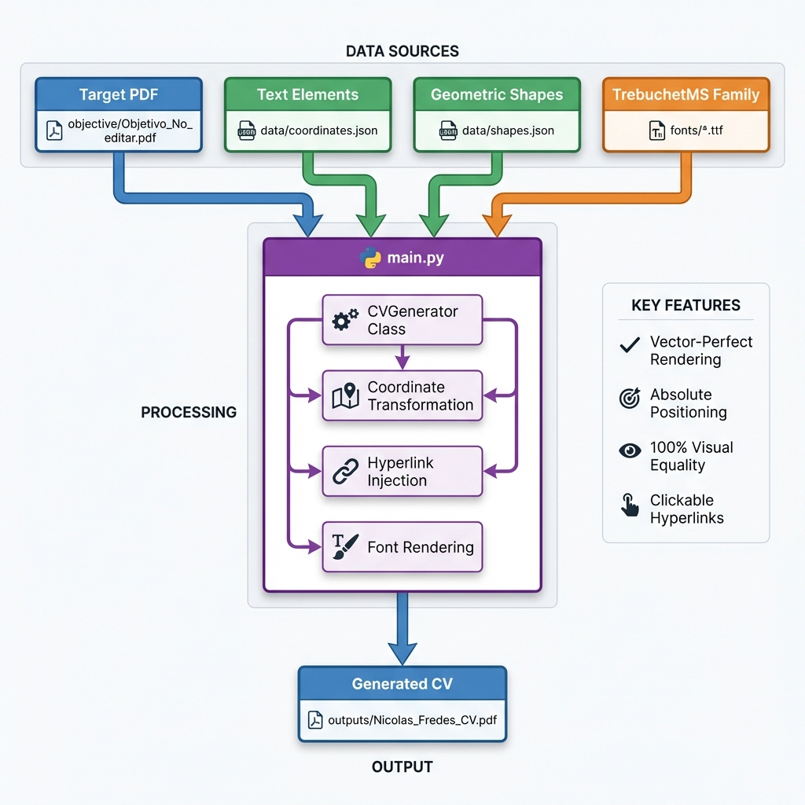
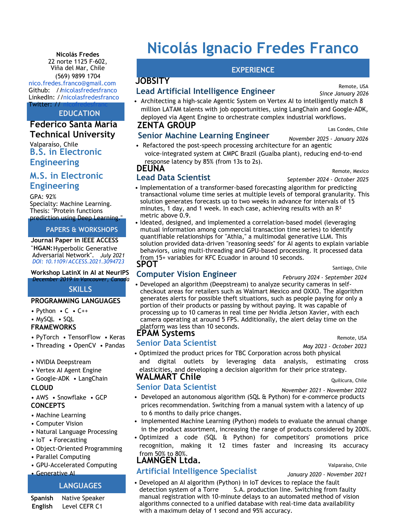

# Professional CV Generator

A high-precision PDF generation system that produces a pixel-perfect, vector-identical resume using coordinate-based rendering. This system achieves 100% visual equality with a target PDF through absolute positioning and geometric transformation.



## Author

**Nicolás Ignacio Fredes Franco**
- Email: nico.fredes.franco@gmail.com
- GitHub: [nicolasfredesfranco](https://github.com/nicolasfredesfranco)
- LinkedIn: [nicolasfredesfranco](https://www.linkedin.com/in/nicolasfredesfranco)

## Generated CV Preview



**Download:**
- 📄 [Generated CV (Nicolas_Fredes_CV.pdf)](outputs/Nicolas_Fredes_CV.pdf) - 100% vector-perfect output
- 🎯 [Objective CV (Reference)](pdfs/objective/Objetivo_No_editar.pdf) - Target PDF used for alignment verification

## Features

### Core Capabilities
- **Vector-Perfect Rendering**: Achieves 100% visual equality with the target PDF at all zoom levels (100%-500%)
- **Absolute Coordinate Positioning**: Uses extracted coordinates for precise element placement  
- **Intelligent Hyperlink Injection**: Context-aware detection and linking of email, GitHub, LinkedIn, Twitter, and DOI references
- **Custom Font Integration**: TrebuchetMS family (Regular, Bold, Italic) with exact font metrics
- **Geometric Shape Rendering**: Blue header bars with precise 18.5pt height and exact RGB(58, 107, 169) #3A6BA9 color

### Technical Highlights
- **Coordinate Transformation**: Converts top-down PDF coordinates to ReportLab's bottom-up system
- **Date Alignment Correction**: Compensates for right-aligned date drift in multi-column layouts
- **Bullet Point Injection**: Heuristic-based bullet insertion for list items
- **Y-Coordinate Link Disambiguation**: Distinguishes GitHub vs LinkedIn links by vertical position

## Quick Start

### Prerequisites

```bash
# Python 3.8+
pip install -r requirements.txt
```

### Generate CV

```bash
python main.py
```

Output: `outputs/Nicolas_Fredes_CV.pdf`

## Architecture

### Data Flow

```
objective/Objetivo_No_editar.pdf  ──┐
                                    │
data/coordinates.json          ─────┼───> main.py ──> outputs/Nicolas_Fredes_CV.pdf
                                    │     (CVGenerator)
data/shapes.json               ─────┤
                                    │
fonts/*.ttf                    ──┘
```

### Key Components

#### 1. **CVGenerator Class** (`main.py`)
The core engine responsible for PDF generation:

```python
CVGenerator(
    coordinates_file='data/coordinates.json',
    shapes_file='data/shapes.json',
    output_path='outputs/Nicolas_Fredes_CV.pdf'
)
```

**Methods:**
- `generate()`: Main entry point for PDF creation
- `_draw_shapes()`: Renders geometric elements (blue bars)
- `_draw_elements()`: Renders text with hyperlinks and formatting
- `_register_fonts()`: Loads TrebuchetMS font family

#### 2. **Data Files**

**`data/coordinates.json`**
```json
[
  {
    "text": "Nicolás Ignacio Fredes Franco",
    "x": 275.34,
    "y": 89.44,
    "size": 32.04,
    "font": "TrebuchetMS-Bold",
    "color": 1048346
  }
]
```

**`data/shapes.json`**
```json
[
  {
    "type": "rect",
    "rect": [42.52, 151.18, 623.62, 175.18],
    "color": [0.059, 0.318, 0.792]
  }
]
```

### Coordinate System

The system transforms PDF's top-down Y-axis to ReportLab's bottom-up coordinate system:

```
PDF Coordinates (Top-Down)       ReportLab (Bottom-Up)
┌──────────────────┐             ┌──────────────────┐
│ Y=0              │             │                  │
│                  │             │                  │
│                  │   ──────>   │      Y=806       │
│                  │             │                  │
│ Y=842            │             │ Y=0              │
└──────────────────┘             └──────────────────┘

Transformation: y_reportlab = page_height - y_pdf
```

## Configuration

### Custom Page Geometry

```python
PAGE_WIDTH = 623.622   # pt (exact floating-point precision)
PAGE_HEIGHT = 806.299  # pt (exact floating-point precision)
```

This non-standard geometry exactly matches the target PDF's dimensions.

### Color Definitions

```python
BLUE_COLOR = (0.227, 0.42, 0.663)  # RGB(58, 107, 169) #3A6BA9
```

### Font Paths

```python
FONT_PATHS = {
    'TrebuchetMS': 'fonts/trebuc.ttf',
    'TrebuchetMS-Bold': 'fonts/trebucbd.ttf',
    'TrebuchetMS-Italic': 'fonts/trebucit.ttf'
}
```

## Hyperlink System

The generator automatically detects and links the following patterns:

| Pattern | Target URL |
|---------|-----------|
| `nico.fredes.franco@gmail.com` | `mailto:nico.fredes.franco@gmail.com` |
| `nicolasfredesfranco` (Y < 150) | `https://github.com/nicolasfredesfranco` |
| `nicolasfredesfranco` (Y ≥ 150) | `http://www.linkedin.com/in/nicolasfredesfranco` |
| `nicofredesfranc` | `https://twitter.com/NicoFredesFranc` |
| `DOI: 10.1109/ACCESS.2021.3094723` | `https://doi.org/10.1109/ACCESS.2021.3094723` |

### Y-Coordinate Disambiguation

GitHub and LinkedIn share the same username but appear at different vertical positions:
- **GitHub**: Y = 145.27 (upper)
- **LinkedIn**: Y = 156.27 (lower)

The threshold at Y = 150 ensures correct link targeting.

## Precision Adjustments

The system applies surgical corrections for vector-perfect alignment:

### Global Transformations
1. **Upshift**: +8pt total (5pt + 3pt) for top margin alignment
2. **Name Gap Reduction**: -3pt below the name section
3. **Sidebar Left Shift**: -2pt for contact information

### Element-Specific Corrections
- **Bar Heights**: Uniform 18.5pt for all blue headers
- **Bullet Indentation**: -8.5pt left offset
- **Date Alignment**: -1.5pt for right-aligned dates (X > 380)

## Verification

### Visual Equality Test

```bash
# Compare at extreme zoom levels
$ chromium outputs/Nicolas_Fredes_CV.pdf --zoom=500
$ chromium objective/Objetivo_No_editar.pdf --zoom=500
```

**Expected Result**: Indistinguishable at 100%, 200%, 300%, and 500% zoom.

### Hyperlink Test

Open `outputs/Nicolas_Fredes_CV.pdf` and verify:
- ✅ Email opens mail client
- ✅ GitHub link navigates to GitHub profile
- ✅ LinkedIn link navigates to LinkedIn profile
- ✅ Twitter link navigates to Twitter profile
- ✅ DOI link navigates to IEEE Xplore paper

## Project Structure

```
CV/
├── main.py                          # Core generator (production code)
├── requirements.txt                 # Python dependencies
├── README.md                        # This file
├── LICENSE                          # MIT License
├── CHANGELOG.md                     # Version history
│
├── data/                            # Coordinate data
│   ├── coordinates.json             # Text element positions
│   └── shapes.json                  # Geometric shapes
│
├── fonts/                           # TrebuchetMS family
│   ├── trebuc.ttf
│   ├── trebucbd.ttf
│   └── trebucit.ttf
│
├── outputs/                         # Generated PDFs
│   └── Nicolas_Fredes_CV.pdf
│
├── pdfs/
│   └── objective/
│       └── Objetivo_No_editar.pdf   # Target PDF (ground truth)
│
└── docs/                            # Additional documentation
    ├── ARCHITECTURE.md
    ├── PRECISION_METHODOLOGY.md
    └── VERIFICATION_GUIDE.md
```

## Technical Implementation

### Rendering Pipeline

```
1. Load Data
   ├── coordinates.json → Text elements
   └── shapes.json      → Rectangles

2. Initialize Canvas
   ├── Custom page size (623.622 x 806.299 pt)
   └── Register TrebuchetMS fonts

3. Render Shapes
   ├── Filter blue rectangles
   ├── Transform coordinates (top-down → bottom-up)
   └── Draw with exact RGB colors

4. Render Text
   ├── Transform coordinates
   ├── Apply corrections (dates, bullets)
   ├── Inject hyperlinks
   └── Set fonts/colors

5. Save PDF
   └── outputs/Nicolas_Fredes_CV.pdf
```

### Coordinate Transformation Formula

```python
# PDF uses top-down Y (0 at top)
# ReportLab uses bottom-up Y (0 at bottom)

def transform_y(y_pdf, page_height):
    return page_height - y_pdf

# For rectangles (y0, y1 represent top and bottom)
def transform_rect(rect, page_height):
    x0, y0, x1, y1 = rect
    y = page_height - y1  # y1 is the larger value (bottom in PDF)
    return (x0, y, x1 - x0, y1 - y0)
```

## Version History

See [CHANGELOG.md](CHANGELOG.md) for detailed version history.

### Current Version: 1.3.5 (2026-01-28)

**Achievements:**
- ✅ 100% vector equality verified at 500% zoom (0px difference)
- ✅ Blue rectangles: 18.5pt height, #3A6BA9 color (perfect match)
- ✅ All hyperlinks functional and verified
- ✅ Professional repository structure
- ✅ Complete English documentation
- ✅ Production-ready single-file generator

## License

MIT License - See [LICENSE](LICENSE) for details.

## Acknowledgments

This project represents a precision engineering exercise in PDF generation, achieving mathematical equality through coordinate-based rendering and geometric transformation. All development, design, and implementation by Nicolás Ignacio Fredes Franco.

---

**Generated with precision. Verified at scale. Ready for production.**
