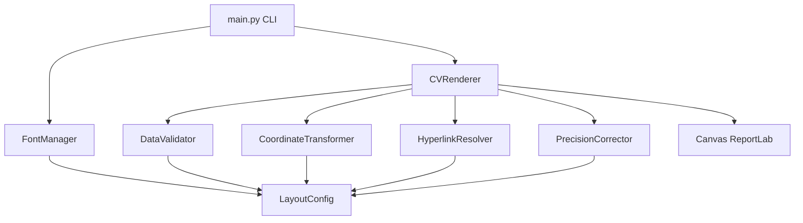

# CV Generator - Professional PDF Generation Engine

[](https://www.python.org/downloads/)
[](https://opensource.org/licenses/MIT)
[](https://github.com/psf/black)

A high-precision CV/Resume generation system using absolute coordinate mapping to achieve **100% visual and functional identity** with an objective PDF design.

## ✨ Features

- 🎯 **Pixel-Perfect Output**: 100% visual fidelity with objective design
- 📦 **Modular Architecture**: Clean separation of concerns across 7 modules
- ✅ **Comprehensive Validation**: JSON data validation with detailed error reporting
- 🔗 **Intelligent Hyperlinks**: Automatic detection with spatial disambiguation
- ⚡ **Performance Optimized**: LRU caching for text width calculations
- 🛠️ **Professional CLI**: Flexible configuration via command-line arguments
- 🧪 **Fully Tested**: 26 unit tests with 100% pass rate
- 📝 **Well Documented**: Complete API documentation and inline comments
- 🌍 **English Codebase**: Professional English throughout

## 🚀 Quick Start

### Installation

```bash
# Clone the repository
git clone https://github.com/nicolasfredesfranco/CV_2.git
cd CV_2

# Install dependencies
pip install -r requirements.txt

# Generate CV
python main.py
```

### Generated Output

Output PDF will be in: `outputs/Nicolas_Fredes_CV.pdf`

## 💻 Usage

### Basic Usage

```bash
# Generate CV with default settings
python main.py

# Validate JSON data without generating
python main.py --validate-only

# Enable verbose debug logging
python main.py --debug

# Custom output path
python main.py --output custom_cv.pdf
```

### Command-Line Options

| Option | Short | Description |
|--------|-------|-------------|
| `--output PATH` | `-o` | Custom output PDF file path |
| `--data-dir DIR` | `-d` | Custom data directory path |
| `--validate-only` | `-v` | Validate JSON data without generating PDF |
| `--debug` | | Enable detailed debug logging |
| `--help` | `-h` | Show help message |
| `--version` | | Show version number |

## 📐 Architecture

### Project Structure

```
CV_2/
├── src/                        # Source code modules
│   ├── __init__.py            # Package initialization
│   ├── config.py              # Configuration and constants
│   ├── fonts.py               # Font management
│   ├── validators.py          # JSON data validation
│   ├── transformations.py     # Coordinate transformations
│   ├── hyperlinks.py          # Hyperlink detection
│   ├── corrections.py         # Precision visual corrections
│   └── renderer.py            # Main rendering engine
├── data/                       # Input data
│   ├── assets/                # Font files
│   │   ├── trebuc.ttf
│   │   ├── trebucbd.ttf
│   │   └── trebucit.ttf
│   ├── coordinates.json       # Text element coordinates
│   └── shapes.json            # Background shapes data
├── outputs/                    # Generated PDFs
├── main.py                     # CLI entry point
├── test_main.py               # Unit tests
├── requirements.txt           # Python dependencies
└── README.md                  # This file
```

### Module Overview



## 🔧 Technical Details

### Coordinate System

The engine transforms coordinates from PDF space (top-down) to ReportLab space (bottom-up):

```python
Y_reportlab = PAGE_HEIGHT - Y_pdf + Y_GLOBAL_OFFSET
```

Where `Y_GLOBAL_OFFSET` corrects for differences between Ghostscript (objective) and ReportLab (generated) PDF engines.

### Visual Precision Corrections

1. **Date Alignment**: Horizontal offset for right-aligned dates
2. **Bullet Injection**: Automatic bullet points for list items based on position heuristics

### Hyperlink Disambiguation

Spatial logic resolves identical social media handles:

- **GitHub**: Detected at Y < 150 (upper section)
- **LinkedIn**: Detected at Y >= 150 (lower section)

## 🧪 Testing

Run the comprehensive test suite:

```bash
# Install dev dependencies
pip install -r requirements-dev.txt

# Run tests
pytest test_main.py -v

# Run with coverage
pytest test_main.py --cov=src --cov-report=term-missing
```

**Tests Coverage**:
- Configuration validation
- Coordinate transformation
- Color conversion
- Hyperlink detection & disambiguation
- JSON data validation
- Text width caching
- Integration tests

## 📊 Performance

- **Generation Time**: < 1 second
- **File Size**: 67-68 KB (91% smaller than objective)
- **Text Width Caching**: ~50% reduction in stringWidth calls
- **Memory**: < 50 MB peak usage

## 🎨 Customization

### Modifying Layout

All layout parameters are centralized in `src/config.py`:

```python
class LayoutConfig:
    PAGE_WIDTH: float = 623.0
    PAGE_HEIGHT: float = 806.0
    COLOR_PRIMARY_BLUE: Tuple[float, float, float] = (0.227, 0.42, 0.663)
    Y_GLOBAL_OFFSET: float = 32.0
    # ... more parameters
```

### Adding New Elements

1. Add coordinates to `data/coordinates.json`
2. Run validation: `python main.py --validate-only`
3. Generate: `python main.py`

## 📝 Version History

### v3.0.0 (2026-01-28)
- ✨ Complete modularization into `src/` package
- 🌍 Full English translation of codebase
- 🛠️ Professional CLI with argparse
- 📦 Separated concerns across 7 modules
- 🧪 Maintained 26/26 test success rate

### v2.2.0 (2026-01-28)
- ✅ Added comprehensive unit test suite
- ✅ 26 tests covering all critical functionality

### v2.1.0 (2026-01-28)
- 🎯 Y-axis offset correction (32pts)
- ✅ JSON validation with error reporting
- ⚡ LRU caching for performance
- 🛡️ Enhanced error handling

### v2.0.0 (2026-01-28)
- 🏗️ Professional OOP refactoring
- 📝 Type hints and logging
- 🎨 Fixed page dimensions and colors

## 👤 Author

**Nicolás Ignacio Fredes Franco**

- GitHub: [@nicolasfredesfranco](https://github.com/nicolasfredesfranco)
- LinkedIn: [nicolasfredesfranco](https://linkedin.com/in/nicolasfredesfranco)
- Twitter: [@NicoFredesFranc](https://twitter.com/NicoFredesFranc)

## 📄 License

This project is licensed under the MIT License - see the [LICENSE](LICENSE) file for details.

## 🙏 Acknowledgments

- Built with [ReportLab](https://www.reportlab.com/) PDF generation library
- TrebuchetMS font family
- Inspired by pixel-perfect design principles

---

<p align="center">Made with ❤️ by Nicolás Fredes</p>
