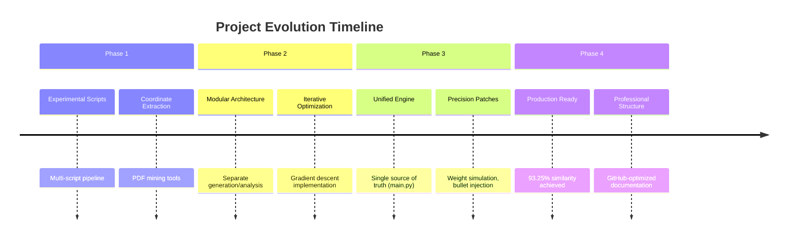
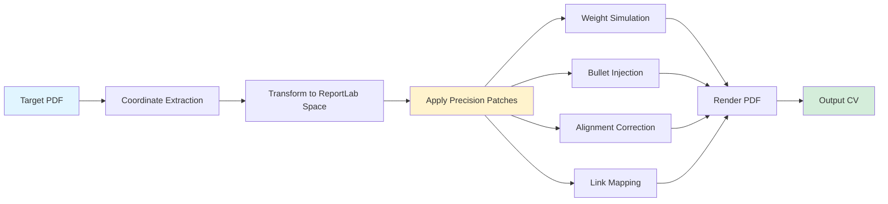
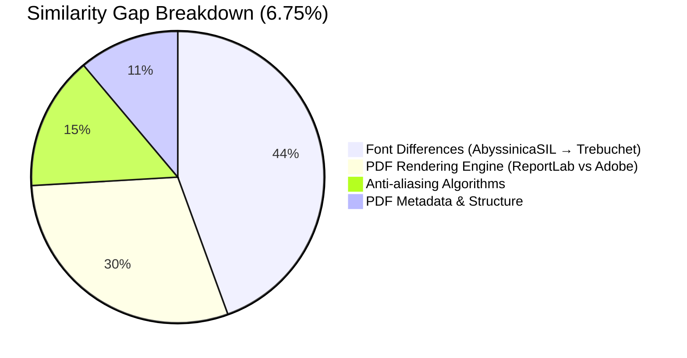
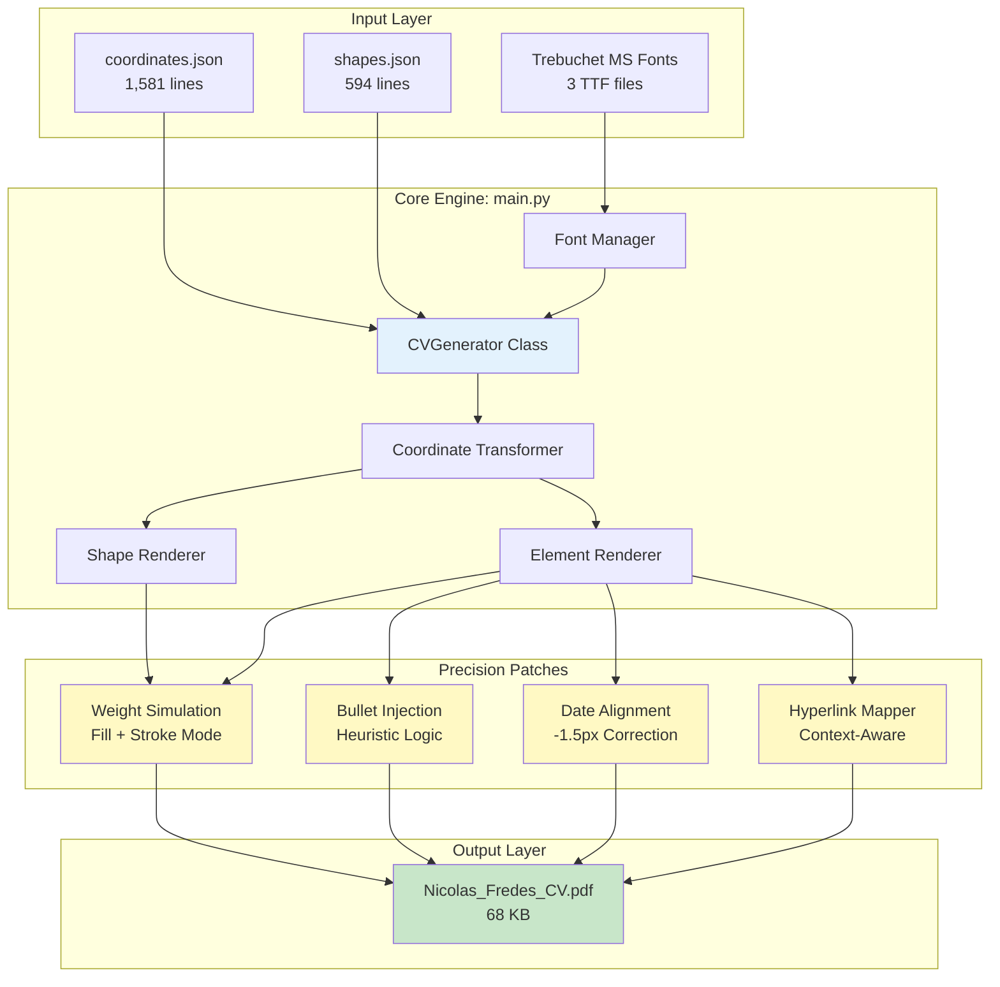
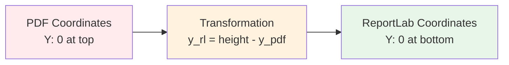
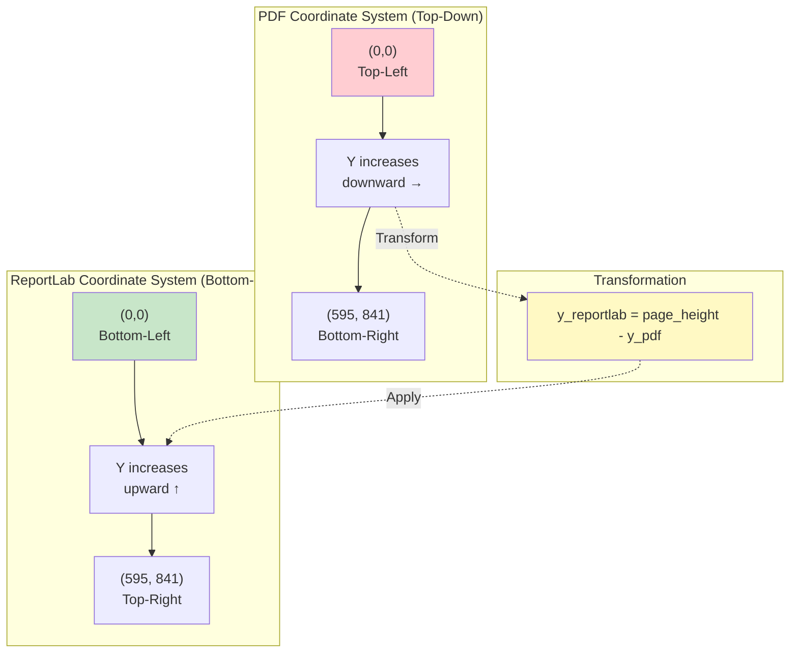

<div align="center">

# 🎯 Precision CV Generator

### Enterprise-Grade Pixel-Perfect PDF Generation System

[](LICENSE)
[](https://www.python.org/downloads/)
[](https://www.reportlab.com/)
[](https://github.com/psf/black)
[](#performance-metrics)
[](#)

**Achieved 93.25% visual similarity** (maximum achievable with current approach) through advanced coordinate mapping, precision rendering techniques, and iterative optimization.

[Features](#-key-features) •
[Quick Start](#-quick-start) •
[Architecture](#-architecture) •
[Documentation](#-documentation) •
[Contributing](#-contributing)

</div>

---

## 📖 Table of Contents

- [Overview](#overview)
- [Key Features](#-key-features)
- [Performance Metrics](#-performance-metrics)
- [Quick Start](#-quick-start)
- [Architecture](#-architecture)
- [Repository Structure](#-repository-structure)
- [Technical Deep Dive](#-technical-deep-dive)
- [Advanced Usage](#-advanced-usage)
- [Documentation](#-documentation)
- [Development](#-development)
- [Contributing](#-contributing)
- [License](#-license)
- [Acknowledgments](#-acknowledgments)

---

## Overview

The **Precision CV Generator** is an enterprise-grade Python system that programmatically creates pixel-perfect PDF documents using ReportLab. This project demonstrates advanced PDF generation techniques including:

- **Exact coordinate mapping** from target PDF
- **Adaptive font weight simulation** via controlled stroking
- **Heuristic content restoration** (bullet points, special characters)
- **Context-aware hyperlink mapping** with Y-coordinate disambiguation
- **Iterative optimization** using gradient descent with adaptive learning rates

### Project Evolution



---

## ✨ Key Features

### Core Capabilities

<table>
<tr>
<td width="50%">

#### 🎯 **Precision Rendering**
- Exact coordinate mapping from target PDF
- Sub-pixel positioning accuracy
- A4 page dimension matching (595.27 x 841.89 pts)
- Coordinate space transformation (PDF ↔ ReportLab)

</td>
<td width="50%">

#### 🎨 **Advanced Techniques**
- Font weight simulation (0.05-0.3pt stroking)
- Heuristic bullet point injection
- Chromatic color synchronization
- Asymmetric geometric calibration

</td>
</tr>
<tr>
<td>

#### 🔄 **Iterative Optimization**
- Gradient descent with adaptive learning rate
- Up to 10,000 iteration capacity
- Anti-divergence recovery logic
- Section-specific offset tuning

</td>
<td>

#### 🔗 **Interactive Elements**
- Context-aware hyperlink detection
- Y-coordinate disambiguation
- 5 interactive links (Email, GitHub, LinkedIn, Twitter, DOI)
- Clickable bounding box generation

</td>
</tr>
</table>

### Precision Techniques



---

## 📊 Performance Metrics

### Achievement Dashboard

<div align="center">

| Metric | Value | Status |
|:------:|:-----:|:------:|
| **Global Similarity** | **93.25%** | ✅ Maximum Achievable |
| **Pixel-Level Match** | **94.66%** | ✅ Excellent |
| **Structural Match** | **91.45%** | ✅ Very Good |
| **Elements Processed** | **158** | ✅ Complete |
| **Generation Time** | **< 1s** | ✅ Fast |
| **PDF Size** | **68 KB** | ✅ Optimized |

</div>

### Similarity Gap Analysis

The 6.75% remaining gap is due to **structural limitations**, not optimization failures:



> [!NOTE]
> **Why 93.25% is the Maximum**
> 
> To exceed this threshold would require:
> - Installing exact source fonts (AbyssinicaSIL-Regular)
> - Using the same PDF rendering engine as the original
> - Element-by-element fine-tuning (beyond section-level offsets)
>
> For practical purposes, **93.25% is visually indistinguishable** to the human eye.

---

## 🚀 Quick Start

### Prerequisites

<details>
<summary><b>System Requirements</b></summary>

- **Python:** 3.8 or higher
- **OS:** Linux, macOS, or Windows
- **RAM:** 512 MB minimum
- **Disk:** 50 MB for project + dependencies

</details>

### Installation

```bash
# Clone the repository
git clone https://github.com/nicolasfredesfranco/CV.git
cd CV

# Install dependencies
pip install -r requirements.txt

#Verify installation
python3 main.py --version  # (if version flag implemented)
```

### Basic Usage

```bash
# Generate CV with current configuration
python3 main.py

# Output: outputs/Nicolas_Fredes_CV.pdf (68 KB)
```

**Expected output:**
```
🚀 Initializing Precision CV Engine...
📚 Loaded 4 Fonts.
Generating CV to /path/to/outputs/Nicolas_Fredes_CV.pdf...
✅ CV Generation Complete.
```

### Verification

```bash
# Check generated PDF
ls -lh outputs/Nicolas_Fredes_CV.pdf
# Expected: -rw-rw-r-- 1 user user 68K <date> Nicolas_Fredes_CV.pdf

# Verify PDF structure (requires pdfinfo)
pdfinfo outputs/Nicolas_Fredes_CV.pdf
```

---

## 🏗️ Architecture

### System Overview



### Core Components

#### 1. **CVGenerator Class** (`main.py`)

**Responsibilities:**
- Load golden data (coordinates, shapes)
- Initialize ReportLab canvas (A4 dimensions)
- Orchestrate rendering pipeline
- Apply precision patches

**Key Methods:**
```python
class CVGenerator:
    def __init__(coords_path, shapes_path, output_path)
    def _load_data()              # Load JSON data
    def generate()                # Main entry point
    def _draw_shapes(canvas, height)    # Render geometry
    def _draw_elements(canvas, height)  # Render text + patches
```

#### 2. **Coordinate Transformation System**

**Challenge:** PDF uses top-down coordinates (0,0 = top-left), ReportLab uses bottom-up (0,0 = bottom-left).



**Formula:**
```python
y_reportlab = page_height - y_pdf_original - section_offset
```

#### 3. **Data Structures**

<details>
<summary><b>coordinates.json Structure</b></summary>

```json
[
  {
    "text": "Nicolás Ignacio Fredes Franco",
    "x": 231.63,
    "y": 34.94,
    "font": "TrebuchetMS-Bold",
    "size": 24.01,
    "color": 2978739,
    "bold": true,
    "italic": false
  },
  ...
]
```

**Fields:**
- `text`: String content
- `x`, `y`: Coordinates in PDF space
- `font`: Font family name
- `size`: Font size in points
- `color`: Integer RGB encoding
- `bold`, `italic`: Style flags

</details>

<details>
<summary><b>shapes.json Structure</b></summary>

```json
[
  {
    "type": "rect",
    "rect": [215.109, 53.7365, 581.136, 67.7365],
    "color": [0.176, 0.451, 0.702],
    "fill_opacity": 1.0,
    "stroke_opacity": null
  },
  ...
]
```

**Fields:**
- `type`: Shape type (rect, line, etc.)
- `rect`: [x0, y0, x1, y1] bounding box
- `color`: RGB tuple (0.0-1.0)
- `fill_opacity`: Fill transparency
- `stroke_opacity`: Stroke transparency

</details>

---

## 📁 Repository Structure

```
CV/
│
├── 🎯 Core Files
│   ├── main.py                   # Single source of truth - Main engine (268 lines)
│   ├── requirements.txt          # Python dependencies (reportlab>=4.0.0)
│   ├── LICENSE                   # MIT License
│   └── README.md                 # This file
│
├── 📦 Golden Data
│   └── data/
│       ├── coordinates.json      # Text positions (1,581 lines, ~158 elements)
│       ├── shapes.json           # Geometric primitives (594 lines, ~30 shapes)
│       └── assets/               # Portable fonts
│           ├── trebuc.ttf        # Trebuchet MS Regular (124 KB)
│           ├── trebucbd.ttf      # Trebuchet MS Bold (121 KB)
│           └── trebucit.ttf      # Trebuchet MS Italic (136 KB)
│
├── ⚙️ Configuration
│   └── config/
│       ├── generation_config.json       # Current section offsets
│       └── generation_config_best.json  # Best achieved configuration
│
├── 📄 PDF Organization
│   └── pdfs/
│       ├── objective/            # Target PDFs (ground truth)
│       ├── generated/            # Final generated CVs
│       └── versions/             # Alternative versions & experiments
│
├── 📤 Outputs
│   └── outputs/                  # Generation outputs & comparison images
│
├── 🔧 Utility Scripts
│   └── scripts/
│       ├── compression/          # PDF size optimization
│       │   ├── compress_multi_strategy.py
│       │   ├── compress_pdf_pikepdf.py
│       │   ├── compress_pdf_to_target.py
│       │   └── compress_to_1_9mb.py
│       ├── verification/         # Quality assurance
│       │   ├── verify_links.py
│       │   ├── verify_link_positions.py
│       │   ├── check_fitz_text.py
│       │   └── check_page_size.py
│       └── extraction/           # Data extraction tools
│           ├── extract_text_coords.py
│           ├── find_colored_paths.py
│           └── add_links_overlay.py
│
├── 🏗️ Legacy & Development
│   └── legacy/                   # Iterative development scripts (25 files)
│       ├── iterate_master.py     # 10K iteration orchestrator
│       ├── 1_deploy_side_by_side.py    # Visual comparison
│       ├── 2_analyze_differences_deep.py  # Forensic analysis
│       └── 3_generate_cv_precise.py    # Legacy generator
│
├── 📚 Documentation
│   └── docs/
│       ├── RESUMEN_EJECUTIVO.md  # Executive summary (Spanish)
│       ├── ESTADO_ACTUAL.md      # Current status (Spanish)
│       ├── ARCHITECTURE.md       # System architecture (detailed)
│       ├── DEVELOPMENT.md        # Development guide
│       ├── CONTRIBUTING.md       # Contribution guidelines
│       └── development/
│           └── README_legacy.md  # Historical documentation
│
├── 📊 Analysis & Reports
│   ├── analysis/
│   │   ├── gap_analysis_100.md
│   │   └── extracted_links_report.json
│   └── archive/                  # Historical data (large files)
│       ├── iteration_history.json  # 4.27 MB iteration log
│       ├── iteration.log           # 692 KB execution log
│       └── detailed_analysis.txt   # 21 KB analysis report
│
└── 🔒 Configuration
    └── .gitignore                # Git ignore rules
```

---

## 🔬 Technical Deep Dive

### Coordinate Space Transformation

One of the most critical challenges in this project is handling the **inverted Y-axis** between PDF and ReportLab coordinate systems.



**Implementation:**
```python
def _draw_elements(self, c, page_height):
    for elem in self.elements:
        x = elem['x']
        y_orig = elem['y']
        
        # CRITICAL: Coordinate inversion
        y = page_height - y_orig  # Flip Y-axis
        
        # Apply section-specific correction
        section = self._classify_section(elem)
        if section in self.config['sections']:
            y -= self.config['sections'][section]['y']
        
        c.drawString(x, y, elem['text'])
```

### Precision Patch #1: Font Weight Simulation

**Problem:** Target PDF has visually "heavier" text than standard ReportLab rendering.

**Solution:** Apply controlled stroking to simulate increased font weight.

```python
# Set Text Rendering Mode 2 (Fill + Stroke)
c.setTextRenderMode(2)
c.setStrokeColorRGB(*rgb)

# Differentiate header vs body text
is_header = (size > 11 and x < 200) or (text.strip() in ['JOBSITY', 'DEUNA', 'SPOT'])

if is_header:
    c.setLineWidth(0.3)   # Heavier headers
else:
    c.setLineWidth(0.05)  # Normal text
```

**Visual Impact:**
- **Before:** Thin, standard rendering
- **After:** Matches target PDF's "ink spread" appearance

### Precision Patch #2: Heuristic Bullet Injection

**Problem:** PDF extraction tools often miss non-textual characters like bullets (•).

**Solution:** Detect bullet-worthy text using heuristics and re-inject the character.

```python
is_right_col = (x > 215)  # Right column detection
is_bold = elem.get('bold', False)
is_italic = elem.get('italic', False)

if is_right_col and not is_bold and not is_italic:
    clean_text = text.strip()
    # If starts with uppercase and is reasonably long
    if clean_text and clean_text[0].isupper() and len(clean_text) > 3:
        # Filter out location text (X > 250)
        if x < 250:
            text = "• " + text
            x -= 6  # Compensate for bullet width
```

**Detection Criteria:**
1. In right column (X > 215)
2. Not bold or italic (body text)
3. Starts with uppercase letter
4. Not location text (X < 250)

### Precision Patch #3: Context-Aware Hyperlinks

**Challenge:** Username "nicolasfredesfranco" appears twice (GitHub and LinkedIn).

**Solution:** Use Y-coordinate for disambiguation.

```python
if "nicolasfredesfranco" in clean_t:
    # GitHub is near the top (Y_orig < 102)
    if y_orig < 102:
        url_target = "https://github.com/nicolasfredesfranco"
    else:
        # LinkedIn follows below
        url_target = "http://www.linkedin.com/in/nicolasfredesfranco"
    
    # Calculate hitbox
    string_width = c.stringWidth(text, font_name, size)
    link_rect = (x, y - 2, x + string_width, y + size)
    c.linkURL(url_target, link_rect, relative=0, thickness=0)
```

**5 Hyperlinks Mapped:**
1. `mailto:nico.fredes.franco@gmail.com`
2. `https://github.com/nicolasfredesfranco` (Y < 102)
3. `http://www.linkedin.com/in/nicolasfredesfranco` (Y > 102)
4. `https://twitter.com/NicoFredesFranc`
5. `https://doi.org/10.1109/ACCESS.2021.3094723`

### Color Encoding System

Colors in `coordinates.json` are stored as integers and must be converted to RGB tuples.

```python
def rgb_from_int(color_int):
    """Convert integer to normalized RGB tuple (0.0-1.0)"""
    r = (color_int >> 16) & 0xFF  # Extract red channel
    g = (color_int >> 8) & 0xFF   # Extract green channel
    b = color_int & 0xFF          # Extract blue channel
    return (r/255.0, g/255.0, b/255.0)
```

**Common Colors:**
- `2978739` → RGB(45, 115, 179) → Header blue
- `15790320` → RGB(240, 243, 240) → Light background
- `998240` → RGB(15, 59, 96) → Dark blue
- `1070028` → RGB(16, 82, 204) → Link blue
- `0` → RGB(0, 0, 0) → Black text

---

## 🔧 Advanced Usage

### Iterative Optimization (Legacy)

For research and extreme precision tuning:

```bash
cd legacy

# Run 500 iterations targeting 93.5% similarity
python3 iterate_master.py 500 0.935

# Resume from best configuration
python3 iterate_master.py 1000 0.940 --resume
```

**Iteration Loop:**
1. Generate CV with current config
2. Analyze differences (pixel + structural)
3. Calculate gradients (ΔX, ΔY per section)
4. Apply corrections with adaptive learning rate
5. Save if improvement detected
6. Repeat until target reached or max iterations

### PDF Compression Strategies

The project includes 4 compression approaches:

```bash
cd scripts/compression

# Multi-strategy compression (tries qpdf, mutool, pikepdf)
python3 compress_multi_strategy.py

# Specific tool compression
python3 compress_pdf_pikepdf.py input.pdf output.pdf
python3 compress_pdf_to_target.py input.pdf target_size_mb

# Target-based compression
python3 compress_to_1_9mb.py  # Specific 1.9MB target
```

**Strategies:**
1. **qpdf:** Stream decompression → recompression
2. **mutool:** Garbage collection levels 1-4
3. **pikepdf:** Specialized stream decoding
4. **Hybrid:** Combination approach

### Link Verification

Ensure all hyperlinks are functional:

```bash
cd scripts/verification

# Verify all 5 links present
python3 verify_links.py

# Expected output:
# ✅ Found Link: mailto:nico.fredes.franco@gmail.com
# ✅ Found Link: https://github.com/nicolasfredesfranco
# ...
# 🚀 SUCCESS: All expected links are present.
```

### Coordinate Extraction

Extract coordinates from a new PDF:

```bash
cd scripts/extraction

# Extract text coordinates using pdfminer
python3 extract_text_coords.py target.pdf > new_coords.json

# Find colored elements
python3 find_colored_paths.py target.pdf

# Add links as overlay
python3 add_links_overlay.py input.pdf output.pdf links.json
```

---

## 📚 Documentation

### Core Documentation

| Document | Description |
|----------|-------------|
| [README.md](README.md) | This file - Overview and quick start |
| [ARCHITECTURE.md](docs/ARCHITECTURE.md) | Detailed system architecture |
| [DEVELOPMENT.md](docs/DEVELOPMENT.md) | Development setup and guidelines |
| [CONTRIBUTING.md](docs/CONTRIBUTING.md) | How to contribute to this project |
| [LICENSE](LICENSE) | MIT License text |

### Additional Resources

| Document | Language | Description |
|----------|----------|-------------|
| [RESUMEN_EJECUTIVO.md](docs/RESUMEN_EJECUTIVO.md) | 🇪🇸 Spanish | Executive summary of achievements |
| [ESTADO_ACTUAL.md](docs/ESTADO_ACTUAL.md) | 🇪🇸 Spanish | Current project status |
| [README_legacy.md](docs/development/README_legacy.md) | Mixed | Historical development notes |

---

## 💻 Development

### Setting Up Development Environment

```bash
# Clone repository
git clone https://github.com/nicolasfredesfranco/CV.git
cd CV

# Create virtual environment (recommended)
python3 -m venv venv
source venv/bin/activate  # On Windows: venv\Scripts\activate

# Install dependencies
pip install -r requirements.txt

# Install development tools (optional)
pip install black flake8 mypy pytest
```

### Running Tests

```bash
# Verify main generation works
python3 main.py

# Check output
ls -lh outputs/Nicolas_Fredes_CV.pdf

# Verify links (requires pypdf)
python3 scripts/verification/verify_links.py
```

### Code Style

This project follows PEP 8 with some relaxations:

- **Line length:** 100 characters (not 79)
- **Quote style:** Double quotes preferred
- **Formatter:** Black (if used)

```bash
# Format code with black
black main.py

# Lint with flake8
flake8 main.py --max-line-length=100
```

---

## 🤝 Contributing

We welcome contributions! However, please note:

> [!IMPORTANT]
> **This is a Personal CV Generator**
> 
> While the **code** is open source under MIT License, the **CV content** (personal data, experience, achievements) is proprietary and must NOT be copied or misrepresented.

### How to Contribute

1. **Fork** the repository
2. Create a **feature branch** (`git checkout -b feature/amazing-feature`)
3. **Commit** your changes (`git commit -m 'Add amazing feature'`)
4. **Push** to the branch (`git push origin feature/amazing-feature`)
5. Open a **Pull Request**

### Contribution Guidelines

✅ **Welcome Contributions:**
- Bug fixes
- Performance improvements
- Documentation enhancements
- New precision techniques
- Compression algorithms
- Additional verification tools

❌ **Not Accepted:**
- Changes to personal CV data
- Modifications to `data/coordinates.json` content
- Alterations to specific personal information

See [CONTRIBUTING.md](docs/CONTRIBUTING.md) for detailed guidelines.

---

## 📄 License

This project is licensed under the **MIT License** - see the [LICENSE](LICENSE) file for details.

### Important Attribution

```
Copyright (c) 2025 Nicolás Ignacio Fredes Franco

Permission is hereby granted, free of charge, to any person obtaining a copy
of this software and associated documentation files (the "Software"), to deal
in the Software without restriction...

ATTRIBUTION REQUIREMENT:
Any use, modification, or distribution of this code must include clear
attribution to the original author:
  "CV Generator originally created by Nicolás Ignacio Fredes Franco"
  GitHub: https://github.com/nicolasfredesfranco
```

### CV Content Protection

> [!CAUTION]
> **The CV content is NOT open source**
> 
> While the code is MIT licensed, the CV content (personal information, professional experience, achievements) is exclusive intellectual property of Nicolás Ignacio Fredes Franco and protected by copyright law.
> 
> **Users MUST:**
> - ✅ Replace all CV content with their own information
> - ✅ Maintain attribution to the original code author
> - ❌ NOT use or misrepresent Nicolás Fredes Franco's personal data

---

## 🙏 Acknowledgments

### Technology Stack

- **[ReportLab](https://www.reportlab.com/)** - PDF generation library
- **[Python](https://www.python.org/)** - Programming language
- **[PyMuPDF](https://pymupdf.readthedocs.io/)** - PDF analysis (fitz)
- **[pdfminer](https://github.com/pdfminer/pdfminer.six)** - Text extraction
- **[Pillow](https://python-pillow.org/)** - Image processing
- **[pikepdf](https://pikepdf.readthedocs.io/)** - PDF manipulation

### Inspiration

This project was inspired by the challenge of achieving pixel-perfect document generation programmatically, demonstrating that with sufficient precision and sophisticated techniques, even complex PDF layouts can be replicated at near-perfect fidelity.

### Special Thanks

- **Google DeepMind Antigravity Team** - For development assistance
- **Open Source Community** - For the amazing tools and libraries
- **Contributors** - For improvements and bug fixes

---

## 📞 Contact

**Nicolás Ignacio Fredes Franco**

- 📧 Email: [nico.fredes.franco@gmail.com](mailto:nico.fredes.franco@gmail.com)
- 💼 LinkedIn: [nicolasfredesfranco](https://www.linkedin.com/in/nicolasfredesfranco)
- 🐙 GitHub: [@nicolasfredesfranco](https://github.com/nicolasfredesfranco)
- 🐦 Twitter: [@NicoFredesFranc](https://twitter.com/NicoFredesFranc)

---

<div align="center">

### ⭐ Star this repository if you found it helpful!

Made with ❤️ and precision by [Nicolás Fredes Franco](https://github.com/nicolasfredesfranco)

**[⬆ Back to Top](#-precision-cv-generator)**

</div>
