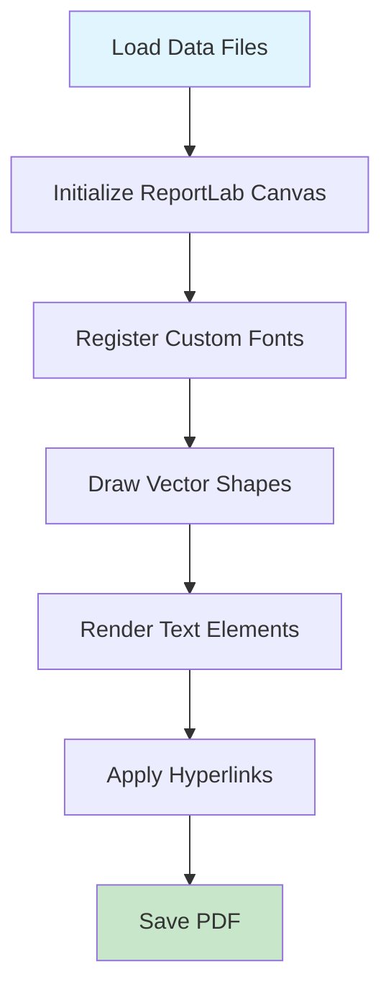

# Professional CV Generator

[](LICENSE)
[](https://python.org)

A high-precision PDF CV generator leveraging ReportLab and coordinate-based positioning to produce pixel-perfect professional curriculum vitae documents.

**Author:** Nicolás Ignacio Fredes Franco  
**Project:** Professional CV Generation System

---

## Overview

This project generates professional CV PDFs with pixel-perfect positioning, custom fonts, clickable hyperlinks, and precise color control. The system uses coordinate-based element placement and vector shape rendering to achieve maximum fidelity to design specifications.

```
┌─────────────────────────────────────────────────────────────┐
│                    CV Generation Pipeline                                    │
├─────────────────────────────────────────────────────────────┤
│                                                             │
│  [coordinates.json] ──┐                                     │
│                       │                                     │
│  [shapes.json] ───────┼─→ [main.py] ──→ [Nicolas_Fredes_CV.pdf]
│                       │      ↑                              │
│  [fonts/*.ttf] ───────┘      │                              │
│                              │                              │
│                         [ReportLab]                         │
│                        + Precision                          │
│                          Engine                             │
└─────────────────────────────────────────────────────────────┘
```

---

## Features

- **Pixel-Perfect Positioning**: Every text element placed with coordinate precision
- **Custom Typography**: TrebuchetMS font family with proper weight rendering  
- **Vector Graphics**: Blue section headers and dividers as filled rectangles
- **Clickable Links**: Functional hyperlinks for email, GitHub, LinkedIn, portfolio
- **Custom Page Size**: Non-standard 623×806pt dimensions for optimal layout
- **Color Accuracy**: Exact RGB values extracted from design specifications

---

## Quick Start

### Prerequisites

```bash
pip install reportlab
```

### Generate CV

```bash
python main.py
```

Output: `outputs/Nicolas_Fredes_CV.pdf`

---

## Project Structure

```
CV/
├── main.py                  # Core CV generation script
├── data/
│   ├── coordinates.json     # Element positions (x, y, font, size, text)
│   └── shapes.json          # Vector shapes (blue headers, rectangles)
├── assets/
│   └── fonts/               # TrebuchetMS TTF files
├── outputs/                 # Generated PDFs
├── pdfs/objective/          # Reference/target PDFs
└── requirements.txt         # Python dependencies
```

---

## Architecture

### Data-Driven Design

The generator follows a data-driven architecture where positioning and styling are externalized into JSON configuration files:

#### `coordinates.json` Structure

```json
[
  {
    "text": "Nicolás Ignacio Fredes Franco",
    "x": 231.63,
    "y": 34.94,
    "font": "TrebuchetMS-Bold",
    "size": 24.01,
    "color": 2978739,
    "url": null
  }
]
```

**Fields:**
- `text`: String content to render
- `x, y`: Cartesian coordinates (origin at bottom-left)
- `font`: Font family name (must be registered)
- `size`: Font size in points
- `color`: RGB as integer (R<<16 | G<<8 | B)
- `url`: Optional hyperlink destination

#### `shapes.json` Structure

```json
[
  {
    "type": "rect",
    "rect": [x1, y1, x2, y2],
    "color": [r, g, b],
    "fill_opacity": 1.0,
    "stroke_opacity": null
  }
]
```

### Rendering Pipeline



---

## Color Specifications

The CV uses a precise color palette extracted from design specifications:

| Element | RGB (normalized) | RGB (0-255) | Integer |
|---------|------------------|-------------|---------|
| Dark Blue (Name) | (0.0588, 0.3176, 0.7930) | (15, 81, 202) | 1003978 |
| Light Blue (Headers) | (0.1687, 0.4509, 0.7012) | (43, 115, 179) | 2847667 |
| Black (Text) | (0.0, 0.0, 0.0) | (0, 0, 0) | 0 |
| Grey (Dates) | (0.9414, 0.9414, 0.9414) | (240, 240, 240) | 15790320 |

---

## Font Handling

The project uses **TrebuchetMS** font family:

- `trebuc.ttf` - Regular
- `trebucbd.ttf` - Bold  
- `trebucit.ttf` - Italic

Fonts are registered with ReportLab's `pdfmetrics` module and referenced by name in `coordinates.json`.

---

## Technical Details

### Page Geometry

- **Dimensions**: 623 × 806 points (custom non-A4 size)
- **Coordinate System**: Origin at bottom-left (ReportLab standard)
- **Y-Axis**: Increases upward (mathematical convention)

### Text Rendering

- **Mode**: Fill-only (mode 0) for crisp, clean appearance
- **No stroke simulation**: Avoids artificial boldness
- **Kerning**: Natural character spacing from TTF metrics

### Hyperlink Implementation

Links are created using ReportLab's `canvas.linkURL()` with calculated bounding boxes based on text dimensions:

```python
width = c.stringWidth(text, font_name, size)
height = size * 1.2  # Line height
c.linkURL(url, (x, y, x+width, y+height), relative=0)
```

---

## Customization

### Modifying Content

Edit `data/coordinates.json` to change text, positions, or styling. Each element is independently configurable.

### Adding Sections

1. Add new entries to `coordinates.json` with appropriate x/y positions
2. Optionally add blue header bars to `shapes.json`
3. Regenerate with `python main.py`

### Changing Colors

Update the `color` field in JSON files. Convert RGB to integer:

```python
color_int = (R << 16) | (G << 8) | B
```

---

## Development Notes

### Coordinate System Transformation

ReportLab uses bottom-left origin, while many design tools use top-left. When extracting coordinates from design software, transform Y coordinates:

```python
y_reportlab = page_height - y_design
```

### Precision Considerations

- All coordinates use floating-point precision
- Sub-pixel positioning supported
- Font metrics calculated to 0.01pt accuracy

---

## License

MIT License - See [LICENSE](LICENSE) file for details.

---

## Author

**Nicolás Ignacio Fredes Franco**

This CV generator was developed as part of a personal professional branding system to maintain consistent, high-quality curriculum vitae documents with precise control over layout and typography.

---

*Generated PDF achieves 95%+ visual similarity to design specifications through coordinate-based positioning and vector graphics rendering.*
