# 🏗️ System Architecture

## Table of Contents

- [Overview](#overview)
- [Architecture Principles](#architecture-principles)
- [System Layers](#system-layers)
- [Core Components](#core-components)
- [Data Flow](#data-flow)
- [Precision Techniques](#precision-techniques)
- [Coordinate System](#coordinate-system)
- [Rendering Pipeline](#rendering-pipeline)
- [Iterative Optimization](#iterative-optimization)
- [Design Decisions](#design-decisions)
- [Performance Considerations](#performance-considerations)

---

## Overview

The Precision CV Generator follows a **layered architecture** with clear separation of concerns:

1. **Data Layer** - Golden data (coordinates, shapes, fonts)
2. **Core Engine** - PDF generation orchestration
3. **Rendering Layer** - Canvas manipulation and drawing
4. **Precision Layer** - Advanced patches and corrections
5. **Output Layer** - PDF serialization

```mermaid
graph TB
    subgraph "📦 Data Layer"
        A1[coordinates.json]
        A2[shapes.json]
        A3[Font Assets]
    end
    
    subgraph "🎯 Core Engine Layer"
        B1[CVGenerator Class]
        B2[Data Loader]
        B3[Config Manager]
    end
    
    subgraph "🖌️ Rendering Layer"
        C1[Canvas Manager]
        C2[Shape Renderer]
        C3[Text Renderer]
        C4[Coordinate Transformer]
    end
    
    subgraph "✨ Precision Layer"
        D1[Weight Simulator]
        D2[Bullet Injector]
        D3[Alignment Corrector]
        D4[Link Mapper]
    end
    
    subgraph "📄 Output Layer"
        E1[PDF Writer]
        E2[File Manager]
    end
    
    A1 --> B2
    A2 --> B2
    A3 --> B1
    B2 --> B1
    B3 --> B1
    B1 --> C1
    C1 --> C2
    C1 --> C3
    C3 --> C4
    C2 --> D1
    C3 --> D1
    C3 --> D2
    C3 --> D3
    C3 --> D4
    D1 --> E1
    D2 --> E1
    D3 --> E1
    D4 --> E1
    E1 --> E2
    
    style B1 fill:#e3f2fd
    style E1 fill:#c8e6c9
```



---

## Architecture Principles

### 1. Single Source of Truth

**main.py** is the authoritative generation engine. All other scripts are either:
- **Legacy:** Historical development artifacts
- **Utilities:** Support tools for analysis/compression
- **Orchestrators:** High-level iteration managers

### 2. Data-Driven Design

Rendering logic is **minimal**. The heavy lifting is done by:
- `coordinates.json` - Exact positions of all text elements
- `shapes.json` - Geometric primitives
- Configuration files - Section offsets

### 3. Immutable Golden Data

`data/coordinates.json` and `data/shapes.json` are **read-only** ground truth extracted from the target PDF. They should never be manually edited during production.

### 4. Layered Precision

Precision is achieved through **stacked techniques**:
1. Base: Exact coordinate mapping
2. Layer 1: Coordinate transformation
3. Layer 2: Section offsets
4. Layer 3: Precision patches (weight, bullets, alignment)
5. Layer 4: Interactive elements (links)

---

## System Layers

### 📦 Data Layer

#### Coordinates JSON Schema

```typescript
interface TextElement {
  text: string;           // Display text
  x: number;             // X coordinate (PDF space)
  y: number;             // Y coordinate (PDF space)
  font: string;          // Font family name
  size: number;          // Font size in points
  color: number;         // Integer-encoded RGB
  bold: boolean;         // Bold flag
  italic: boolean;       // Italic flag
}
```

**Example:**
```json
{
  "text": "Software Engineer",
  "x": 231.63,
  "y": 120.45,
  "font": "TrebuchetMS",
  "size": 12.0,
  "color": 0,
  "bold": false,
  "italic": false
}
```

#### Shapes JSON Schema

```typescript
interface Shape {
  type: "rect" | "line" | "path";
  rect: [number, number, number, number];  // [x0, y0, x1, y1]
  color: [number, number, number];         // RGB tuple (0.0-1.0)
  fill_opacity: number | null;
  stroke_opacity: number | null;
}
```

**Example:**
```json
{
  "type": "rect",
  "rect": [215.109, 53.7365, 581.136, 67.7365],
  "color": [0.176, 0.451, 0.702],
  "fill_opacity": 1.0,
  "stroke_opacity": null
}
```

---

### 🎯 Core Engine Layer

#### CVGenerator Class Architecture


#### Initialization Flow


---

### 🖌️ Rendering Layer

#### Shape Rendering

**Process:**
1. Filter blue shapes (header backgrounds)
2. Transform coordinates (PDF → ReportLab)
3. Set fill color and opacity
4. Draw rectangle

```python
def _draw_shapes(self, c, page_height):
    BLUE_COLOR = (0.176, 0.451, 0.702)
    
    for shape in self.shapes:
        if shape['type'] != 'rect':
            continue
            
        sc = tuple(shape['color'])
        
        # Color similarity check (blue headers only)
        if not color_is_similar(sc, BLUE_COLOR):
            continue
        
        rect = shape['rect']  # [x0, y0, x1, y1]
        x0, y0, x1, y1 = rect
        
        w = x1 - x0
        h = y1 - y0
        
        # Coordinate transformation: PDF → ReportLab
        y = page_height - y1
        
        c.setFillColorRGB(*sc)
        c.rect(x0, y, w, h, stroke=0, fill=1)
```

#### Text Rendering Pipeline


---

## Precision Techniques

### Technique #1: Font Weight Simulation

**Problem:** ReportLab's standard `drawString()` renders text lighter than target PDF.

**Root Cause:**
- Target PDF likely uses Adobe rendering engine
- Different font rasterization algorithms
- Potential font hinting differences

**Solution:**
```python
# Use Text Rendering Mode 2 (Fill + Stroke)
c.setTextRenderMode(2)  # Fill text, then stroke outline
c.setStrokeColorRGB(*rgb)

# Adaptive stroke widths
if is_header:
    c.setLineWidth(0.3)   # Headers: heavier weight
else:
    c.setLineWidth(0.05)  # Body: subtle weight boost
```

**Visual Impact:**

| Rendering | Stroke Width | Visual Effect |
|-----------|--------------|---------------|
| Standard (Mode 0) | N/A | Thin, light text |
| Fill + Stroke (Mode 2) | 0.05pt | Slightly bolder, matches body text |
| Fill + Stroke (Mode 2) | 0.3pt | Bold headers, similar to target |

**Detection Logic for Headers:**
```python
is_header = (size > 11 and x < 200) or (text.strip() in ['JOBSITY', 'DEUNA', 'SPOT'])
```

---

### Technique #2: Heuristic Bullet Injection

**Problem:** PDF extraction tools cannot detect visual bullets (•) as they're rendered as glyphs, not text.

**Challenge:** How to know which lines should have bullets?

**Solution:** Pattern recognition based on:
1. **Column position**: Right column (X > 215)
2. **Text style**: Non-bold, non-italic (body text)
3. **Text pattern**: Starts with uppercase letter
4. **Text length**: > 3 characters (avoid acronyms)
5. **Exclusion filter**: Not location text (X < 250)

```python
def should_inject_bullet(elem):
    text = elem['text']
    x = elem['x']
    is_bold = elem.get('bold', False)
    is_italic = elem.get('italic', False)
    
    # Must be in right column
    if x <= 215:
        return False
    
    # Must be body text (not bold/italic)
    if is_bold or is_italic:
        return False
    
    clean_text = text.strip()
    
    # Must start with uppercase and be substantial
    if not (clean_text and clean_text[0].isupper() and len(clean_text) > 3):
        return False
    
    # Filter out location text (appears further right)
    if x >= 250:
        return False
    
    return True

if should_inject_bullet(elem):
    text = "• " + text
    x -= 6  # Compensate left for bullet width
```

**Compensations:**
- **Bullet character**: `"• "` (U+2022 + space)
- **X-offset**: -6pt to align bullet with text block

---

### Technique #3: Date Alignment Correction

**Problem:** Right-aligned dates (e.g., "2023 - Present") render slightly off.

**Root Cause:**
- Different string width calculations between PDF engines
- Font metric variations

**Solution:**
```python
# Detect right-aligned dates (top-right quadrant)
if x > 380 and y > (page_height - 750):
    x -= 1.5  # Shift 1.5pt left
```

**Detection Criteria:**
- X > 380 (right side of page)
- Y > (page_height - 750) (top section)

**Impact:** Improves alignment score by ~0.3%

---

### Technique #4: Context-Aware Hyperlink Mapping

**Challenge:** Same text appears multiple times with different link targets.

**Example:**
- "nicolasfredesfranco" → GitHub (top occurrence)
- "nicolasfredesfranco" → LinkedIn (bottom occurrence)

**Solution:** Y-coordinate disambiguation

```python
LINK_PATTERNS = {
    "nico.fredes.franco@gmail.com": "mailto:nico.fredes.franco@gmail.com",
    "nicolasfredesfranco": None,  # Requires disambiguation
    "NicoFredesFranc": "https://twitter.com/NicoFredesFranc",
    "doi.org/10.1109/ACCESS.2021.3094723": "https://doi.org/10.1109/ACCESS.2021.3094723"
}

def map_link(text, y_orig):
    if "nicolasfredesfranco" in text:
        if y_orig < 102:
            return "https://github.com/nicolasfredesfranco"
        else:
            return "http://www.linkedin.com/in/nicolasfredesfranco"
    
    # ... other patterns
```

**Link Rectangle Calculation:**
```python
string_width = c.stringWidth(text, font_name, size)
link_rect = (x, y - 2, x + string_width, y + size)
c.linkURL(url, link_rect, relative=0, thickness=0)
```

**Breakdown:**
- `x`: Left edge of text
- `y - 2`: Extend slightly below baseline
- `x + string_width`: Right edge based on font metrics
- `y + size`: Top edge (font size above baseline)
- `thickness=0`: Invisible border

---

## Coordinate System

### PDF vs ReportLab Coordinate Spaces

```mermaid
graph TB
    subgraph "PDF Coordinate System"
        direction TB
        A1["Origin (0, 0)<br/>📍 Top-Left Corner"]
        A2["X-Axis →<br/>Increases Right"]
        A3["Y-Axis ↓<br/>Increases Down"]
        A4["Max (595.27, 841.89)<br/>📍 Bottom-Right (A4)"]
        
        A1 --> A2
        A2 --> A4
        A1 --> A3
        A3 --> A4
    end
    
    subgraph "ReportLab Coordinate System"
        direction TB
        B1["Origin (0, 0)<br/>📍 Bottom-Left Corner"]
        B2["X-Axis →<br/>Increases Right"]
        B3["Y-Axis ↑<br/>Increases Up"]
        B4["Max (595.27, 841.89)<br/>📍 Top-Right (A4)"]
        
        B1 --> B2
        B2 --> B4
        B1 --> B3
        B3 --> B4
    end
    
    A1 -.Transform.-> B3
    A4 -.Transform.-> B1
```



### Transformation Formula

**Core Equation:**
```
y_reportlab = page_height - y_pdf
```

**With Section Offset:**
```
y_reportlab = page_height - y_pdf - section_offset_y
```

**Implementation:**
```python
PAGE_HEIGHT = 841.89  # A4 height in points

def transform_y(y_pdf, section_offset=0):
    """Transform PDF Y to ReportLab Y"""
    return PAGE_HEIGHT - y_pdf - section_offset
```

**Example:**
```python
# PDF coordinate: Y = 100 (near top of page)
y_rl = 841.89 - 100
# y_rl = 741.89 (near top in ReportLab)

# PDF coordinate: Y = 800 (near bottom of page)
y_rl = 841.89 - 800
# y_rl = 41.89 (near bottom in ReportLab)
```

---

## Rendering Pipeline

### Complete Generation Flow


### Performance Metrics

| Phase | Time | Operations |
|-------|------|------------|
| **Data Loading** | ~10ms | Read 2 JSON files |
| **Canvas Creation** | ~5ms | Initialize ReportLab |
| **Shape Rendering** | ~50ms | ~30 shapes |
| **Text Rendering** | ~200ms | ~158 elements |
| **Precision Patches** | ~100ms | Per-element logic |
| **PDF Saving** | ~50ms | Write & compress |
| **Total** | **~415ms** | **Complete flow** |

---

## Iterative Optimization

### Gradient Descent Approach

The `legacy/iterate_master.py` script implements a **gradient descent optimizer** for section offsets.

```mermaid
graph LR
    A[Generate CV<br/>with config N] --> B[Analyze Differences<br/>Pixel + Structural]
    B --> C[Calculate Gradients<br/>ΔX, ΔY per section]
    C --> D{Score Improved?}
    D -->|Yes| E[Save Best Config]
    D -->|No| F{Diverging?}
    E --> G[Update Config N+1]
    F -->|Yes| H[Restore Best Config<br/>Reduce Learning Rate]
    F -->|No| G
    H --> G
    G --> I{Max Iterations<br/>or Target Reached?}
    I -->|No| A
    I -->|Yes| J[Complete]
    
    style E fill:#c8e6c9
    style H fill:#ffcdd2
    style J fill:#e8f5e9
```



### Adaptive Learning Rate

```python
def calculate_learning_rate(score):
    """Adaptive learning rate based on current performance"""
    if score > 0.98:
        return 0.002, 0.2    # Very small adjustments near optimal
    elif score > 0.94:
        return 0.01, 0.5     # Small adjustments
    elif score > 0.90:
        return 0.05, 2.0     # Medium adjustments
    elif score > 0.85:
        return 0.1, 3.0      # Larger adjustments
    else:
        return 0.3, 5.0      # Aggressive search
    
    # Returns (learning_rate, max_correction_px)
```

**Rationale:**
- **High scores (>98%)**: Tiny adjustments to avoid overshooting
- **Medium scores (90-94%)**: Balanced exploration
- **Low scores (<85%)**: Aggressive corrections to escape local minima

### Divergence Detection

```python
if current_score < (best_score - 0.02):
    # Score dropped by >2%
    print("⚠️ DIVERGENCE DETECTED")
    
    # Restore best configuration
    config = load_config("config/generation_config_best.json")
    
    # Reduce learning rate by 50%
    learning_rate *= 0.5
    
    # Resume optimization
```

---

## Design Decisions

### Why Single-File Engine?

**Rationale:**
1. **Simplicity**: All generation logic in one place
2. **Portability**: Easy to copy `main.py` + `data/` for deployment
3. **Maintainability**: Fewer files to keep in sync
4. **Debugging**: Single execution path

**Trade-off:** 268-line file is manageable but approaching complexity threshold. Future work may modularize into:
- `generator.py` - Core CVGenerator class
- `renderers.py` - Shape and text rendering
- `patches.py` - Precision techniques
- `utils.py` - Helper functions

### Why JSON for Data Storage?

**Advantages:**
1. **Human-readable**: Easy to inspect and debug
2. **Standard format**: Native Python support
3. **Version control friendly**: Git diffs are meaningful
4. **Tool support**: Many editors have JSON validation

**Alternatives Considered:**
- **CSV**: Not suitable for nested data (shapes)
- **Pickle**: Not human-readable, version-dependent
- **Database**: Overkill for static data
- **Binary format**: Faster but loses readability

### Why Not Use Original Fonts?

**Challenge:** Target PDF uses `AbyssinicaSIL-Regular` which is:
- Not freely redistributable in this repository
- Licensed under SIL Open Font License (requires separate installation)
- Large file size (~500KB per weight)

**Solution:** Use **Trebuchet MS** as portable substitute:
- Freely redistributable with projects
- Similar metrics (x-height, character widths)
- Smaller file size (~120KB per weight)
- Achieves 93.25% similarity (acceptable trade-off)

**To achieve >95%:** Users must install AbyssinicaSIL fonts and update `FONT_PATHS` in `main.py`.

---

## Performance Considerations

### Time Complexity

| Operation | Complexity | Notes |
|-----------|------------|-------|
| Load JSON | O(n) | n = number of elements |
| Transform coordinates | O(1) | Per element |
| Render shapes | O(s) | s = number of shapes (~30) |
| Render text | O(e) | e = number of elements (~158) |
| Precision patches | O(e) | Per-element checks |
| **Total** | **O(n + s + e)** | **Linear in data size** |

### Space Complexity

| Component | Size | Notes |
|-----------|------|-------|
| coordinates.json | ~79 KB | 1,581 lines |
| shapes.json | ~30 KB | 594 lines |
| Fonts (3x TTF) | ~380 KB | Loaded into memory |
| Generated PDF | ~68 KB | Final output |
| **Memory Peak** | **~2 MB** | Including ReportLab overhead |

### Optimization Opportunities

1. **Lazy Font Loading**: Load fonts only when needed
2. **Shape Caching**: Pre-filter blue shapes once
3. **Batch Rendering**: Group elements by font for fewer state changes
4. **Parallel Processing**: Multi-threaded rendering (limited by GIL)

**Current Status:** Not needed - <500ms generation time is acceptable.

---

## Conclusion

This architecture achieves **93.25% visual similarity** through:

1. ✅ **Data-Driven Design** - Golden data drives rendering
2. ✅ **Precise Transformations** - Correct coordinate mapping
3. ✅ **Layered Precision** - Stacked correction techniques
4. ✅ **Smart Heuristics** - Pattern-based content restoration
5. ✅ **Iterative Refinement** - Gradient descent optimization

The system is **production-ready**, **maintainable**, and **extensible** for future enhancements.

---

**Next Steps:**
- See [DEVELOPMENT.md](DEVELOPMENT.md) for contribution guidelines
- See [README.md](../README.md) for usage instructions
- See [CONTRIBUTING.md](CONTRIBUTING.md) for how to contribute
